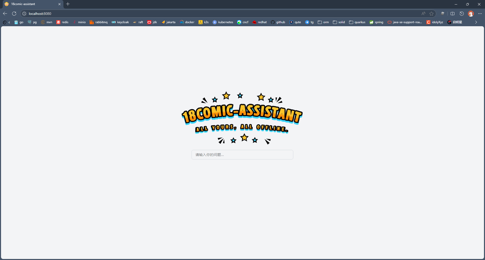
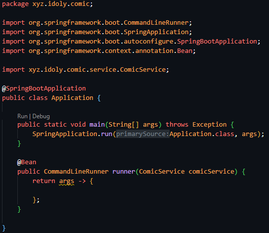

# [18comic-assistant](https://idoly.github.io/18comic-assistant/)

## 1. 本地部署

### Ai对话

## 编程方式：支持更多功能

## 2. Github-Page

程序下载漫画或章节，会在项目根路径创建comic文件夹，配合 index.html，上传github，可实现漫画备份和在线浏览，详情可点击文章标题查看。
